# Setup Unity and Haxe

You can use the example repo made by [Dan Korostelev aka Nadako](https://github.com/nadako): [unity-haxe-helloworld](https://github.com/nadako/unity-haxe-helloworld). It's a basic hello world for Unity and Haxe.

But you can also start from scratch and follow this setup.


## Unity

Open Unity and follow "instructions":

- Give it a project name: (I used) "SetupUnityHaxe"
- Use the Template: 3D

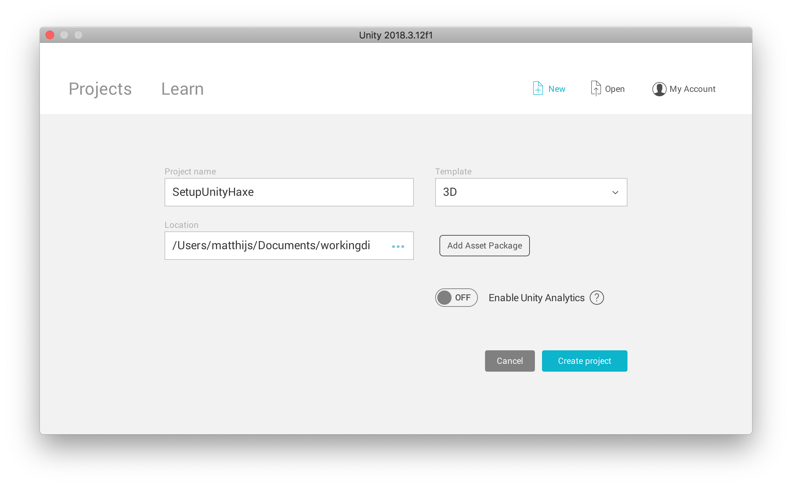

You will end up with:

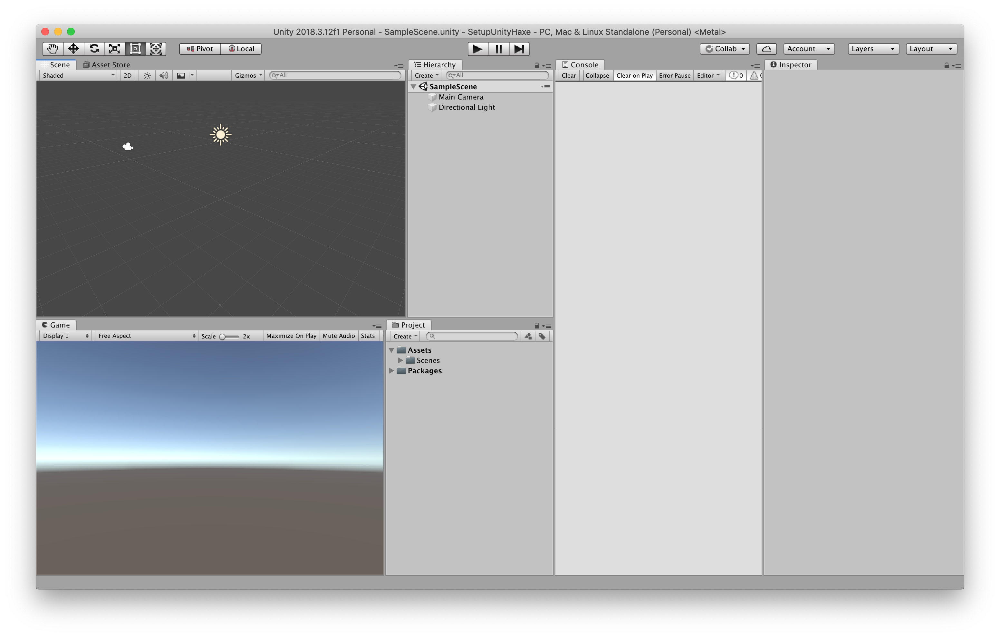

## Folder structure

Default Unity creates the following folders:

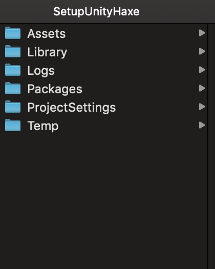

Add a `Source` folder which will hold the Haxe files.

```
+ SetupUnityHaxe
	+ Source
		- Main.hx
```


## The Main.hx

Open your favourite editor, copy/paste the code and save it in the `Source` folder.

```haxe
import unityengine.*;

@:nativeGen
class Main extends MonoBehaviour {
	var who:String;

	function Awake() {
		Debug.Log('Hello, $who!');
	}
}

```

## Build file


Add the `build.hxml` in the root

```bash
-cp Source
-D net-ver=40
# windows
# -net-lib C:\Program Files (x86)\Unity\Editor\Data\Managed\UnityEngine.dll
# osx
# -net-lib /Applications/Unity/Unity.app/Contents/Managed/UnityEngine.dll
# osx with Unity Hub
-net-lib /Applications/Unity/Hub/Editor/2018.3.12f1/Unity.app/Contents/Managed/UnityEngine.dll
-cs Assets/Code
-D no-compilation
-D real-position
Main
```

Do you want to know more about the build file, check out [build example](../09build/example.md).

## Updated folder structure

After adding a source folder and a build file:


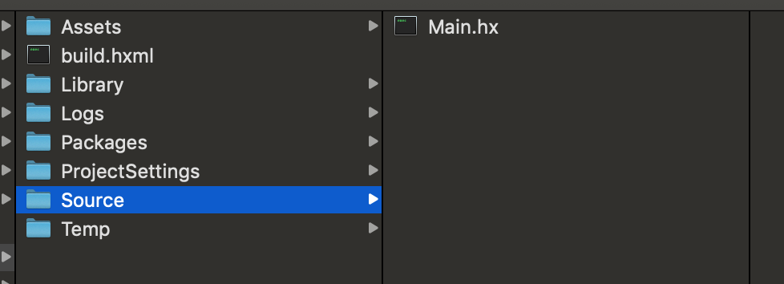


## Run Haxe

```bash
haxe build.hxml
```

And this will generate C# files in `/Assets/Code/src`.

## Update Unity

Just open Unity and it will update everything (I can't explain it better)

After the update you can find your newly generate C# files in `Assets/Code/src/Main` in the **Project** Panel


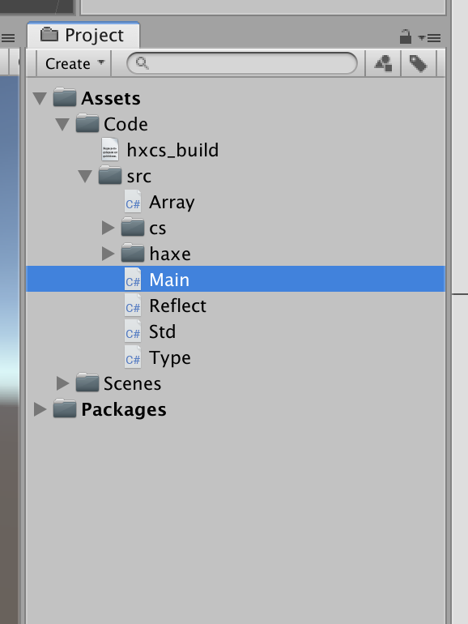

Click on "Main Camera" in you **Hierarchy** panel

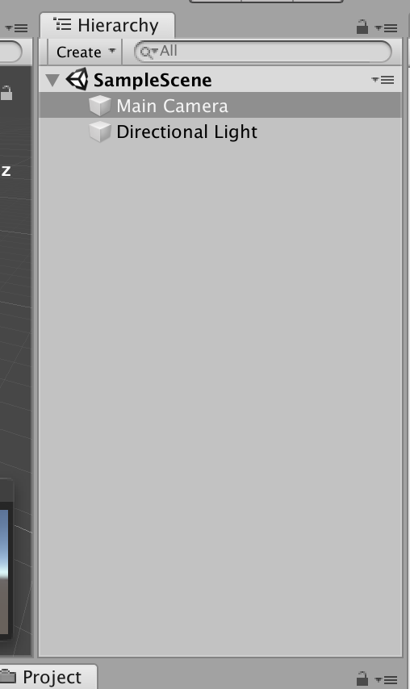

And click on "Add Component"-button at the bottom of the **Inspector** panel

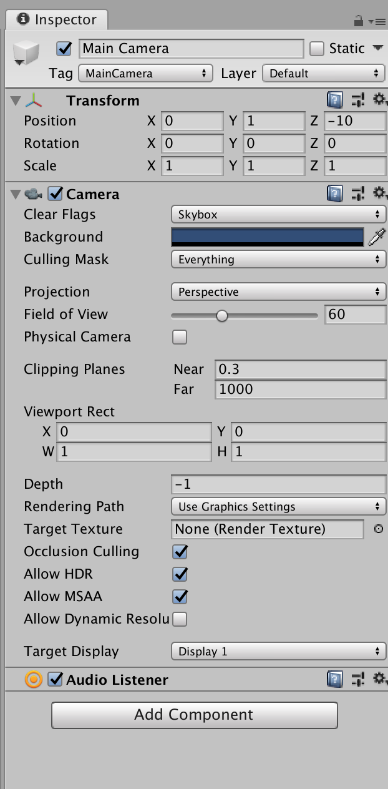

Search for `Main` script

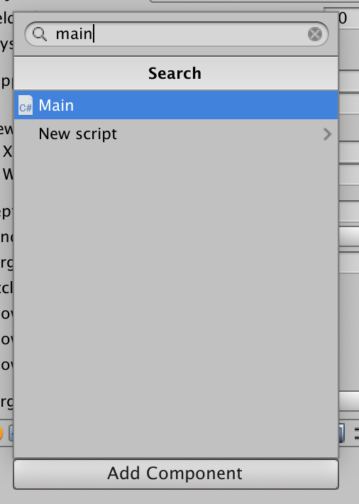

Now the script is added to the camera

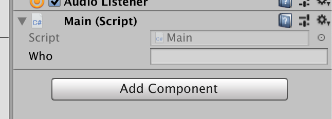

Fill in your name (for example "Foobar")


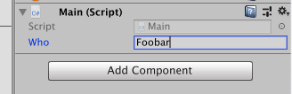

Press "Play" (short cut on osx: `cmd`+`p`)

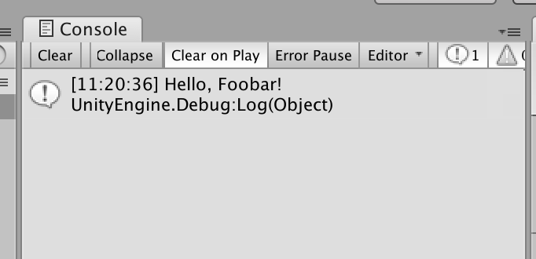

And you will seen in the **Console** panel the log "Hello, Foobar!"


