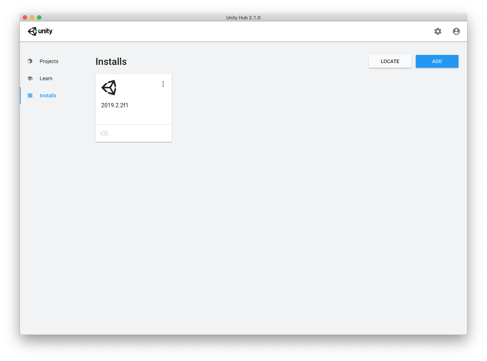
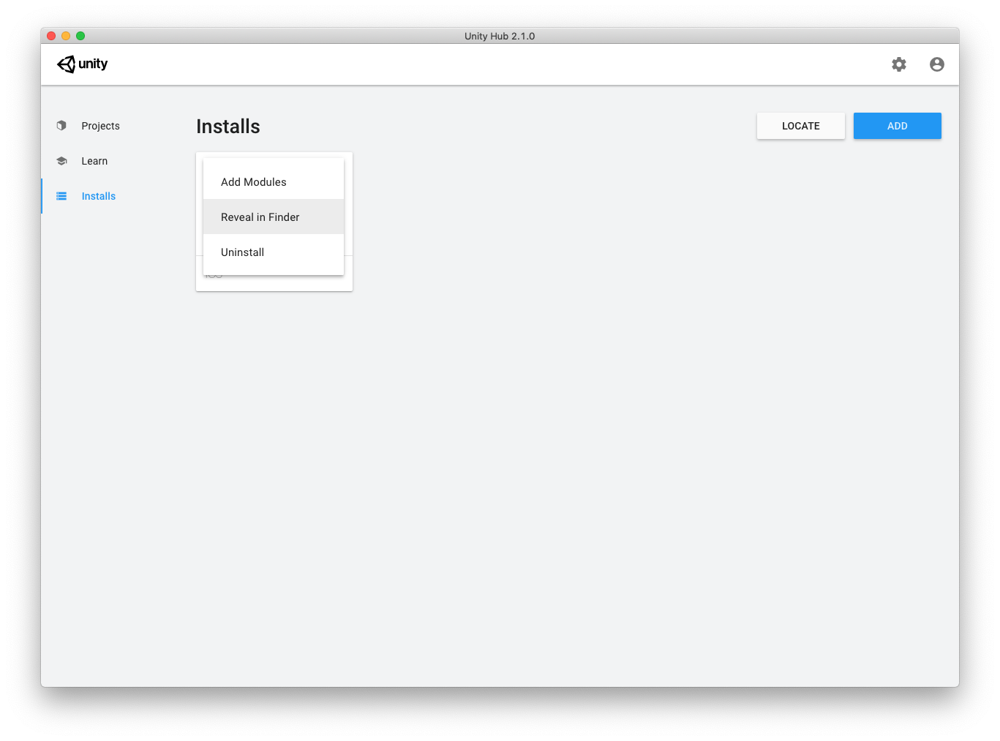

# Build file


I used the hello world from Nadako as a starting point for the combination Haxe (C#) and Unity:
<https://github.com/nadako/unity-haxe-helloworld>


And the build file will show you what you need to do to wire it into Unity:

```bash
-cp Source
-D net-ver=40
-net-lib C:\Program Files (x86)\Unity\Editor\Data\Managed\UnityEngine.dll
# -net-lib /Applications/Unity/Unity.app/Contents/Managed/UnityEngine.dll
-cs Assets/Code
-D no-compilation
Main
```

Let's see what this build script is doing:

```bash
-cp Source
```

To tell the compiler which folder holds all our code: `-cp Source`.
Normally I would use `src` for a folder-name, but C# coding convention seems to favor capitalize names so `Source` sounds about right.
This is used for all Haxe targets, so if you are familiar with Haxe, this one should not be a surprise.


```bash
-D net-ver=40
```

Tells the compiler up to which .NET version to use.


As you might notice you see you need to point the `-net-lib` to the correct location on your computer:

```bash
# Windows (you might find it here)
-net-lib C:\Program Files (x86)\Unity\Editor\Data\Managed\UnityEngine.dll
```

```bash
# Osx (you might find it here)
-net-lib /Applications/Unity/Unity.app/Contents/Managed/UnityEngine.dll
```

I work on mac so I can only comment on how the mac works.
And I used "Unity Hub" to install Unity.
In my case the location was different:

```bash
# Osx (Unity installed via 'Unity Hub")
-net-lib /Applications/Unity/Hub/Editor/2019.2.2f1/Unity.app/Contents/Managed/UnityEngine.dll
```


```bash
-cs Assets/Code
```

To tell the compiler which target to use: `-cs` is the C# target
And which folder will be used for the transpiled code: `Assets/Code` in this case.
Normally I would use `src` for a folder-name, but C# coding convention (or this might also be Unity's way) seems to favor capitalize names so `Assets/Code` sounds about right.


```bash
-D no-compilation
```

Tell the compiler to only generate C# sources and don't invoke C# compiler on them.


```bash
Main
```

What source file is the starting point of your code


## Haxe/C# Defines

Source: <https://haxe.org/manual/target-cs-defines.html>


One I want to mention is:

```bash
-D real-position
```

This don't generate `#line` directives that map C# expression positions to original `.hx` files. Useful for tracking down issues related to code generation.


## Find Unity install

I have Unity hub installed on Osx, so that is my main source for this knowledge.


Open Unity Hub on Installs



Click on the 3 dots, and use "Reveal in Finder"



Use this knowledge to change the `-net-lib`

```bash

# previous install
#-net-lib /Applications/Unity/Hub/Editor/2018.2.2f1/Unity.app/Contents/Managed/UnityEngine.dll
# after upgrading Unity:
-net-lib /Applications/Unity/Hub/Editor/2019.2.2f1/Unity.app/Contents/Managed/UnityEngine.dll
```

happy coding!


