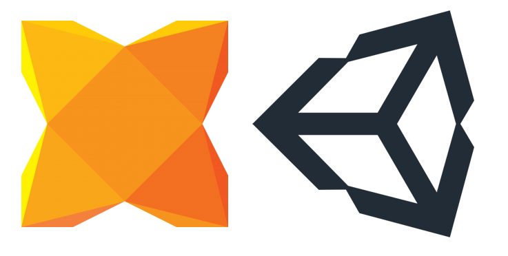

# About haxeunity (Haxe, Unity and C#)

I was working on a Unity 3D project, and I was curious if I could get it to work with Haxe-C# target.
To be clear, I know this could be called C# documentation as well, but I needed more info about the combination Haxe/Unity/C#.
That is what I will be focusing on.

## What is Unity?

> Start bringing your vision to life today. Unity’s real-time 3D development platform empowers you with all you need to create, operate, and monetize.

Source: <https://unity.com/>

> Unity is a cross-platform game engine developed by Unity Technologies, first announced and released in June 2005 at Apple Inc.'s Worldwide Developers Conference as a Mac OS X-exclusive game engine. As of 2018, the engine had been extended to support more than 25 platforms.

Source: <https://en.wikipedia.org/wiki/Unity_(game_engine)>

## What is C#?

Might be helpful to know there are different ways of spelling C#:

- cs
- C#
- C Sharp

> C# is a general-purpose, multi-paradigm programming language encompassing strong typing, lexically scoped, imperative, declarative, functional, generic, object-oriented, and component-oriented programming disciplines.

Source: <https://en.wikipedia.org/wiki/C_Sharp_(programming_language)>

